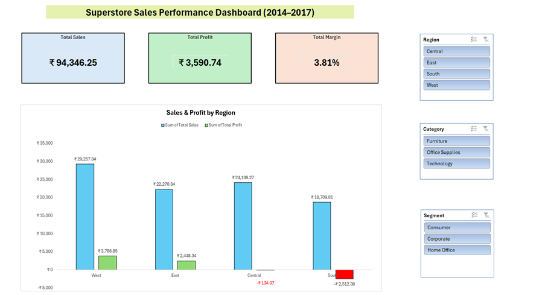
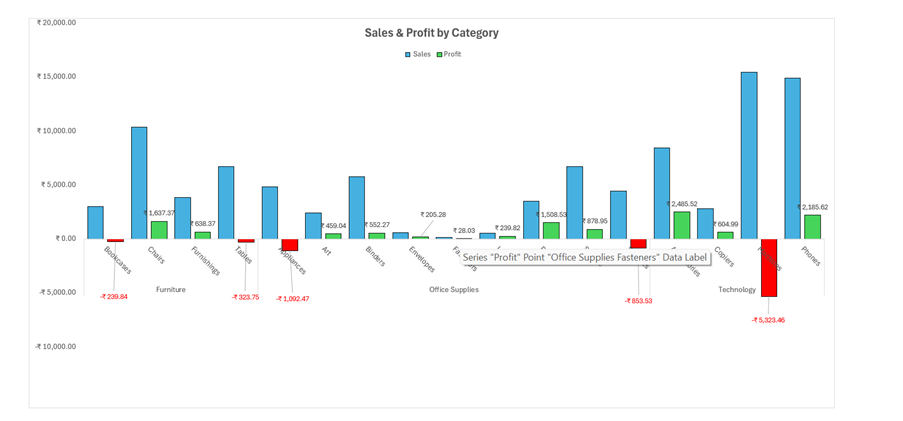
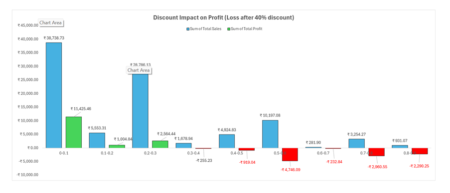
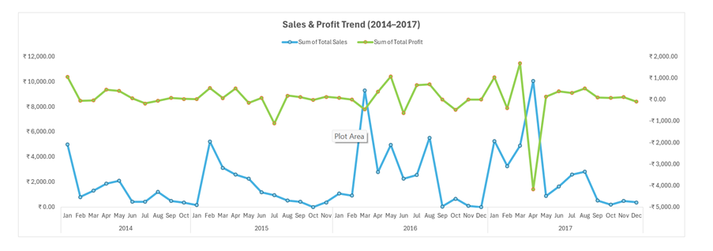

# Superstore-Sales-Analytics-Dashboard-2014-2017-
Developed an interactive Sales Analytics Dashboard in Excel using the Superstore dataset (2014–2017). Performed data cleaning, feature engineering, and built Pivot Tables and charts to analyze sales, profit, discount impact, and trends. Implemented slicers for dynamic filtering and business insights.

## Dashboard Screenshots

### Main Dashboard

### Dashboard View 2

### Dashboard View 3

### Dashboard View 4

